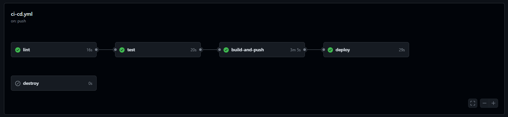

# UFSCar - ML in Production - Módulo Eng. de ML 2 - Atividade 2

## Projeto de classificação de Iris com esteira de CI/CD com Actions do GitHub

Este repositório contém o código e os artefatos para a atividade 2 do módulo 2 de Engenharia de Machine Learning, parte do curso de pós-graduação *ML in Production* da UFSCar. O projeto consiste em um modelo de Machine Learning para classificar flores Iris, uma API Flask para predição online, Docker para containerização da aplicação, provisionamento de recursos na AWS com Terraform, e esteira de CI/CD com quatro jobs: de lint, teste, build/push, e deploy.

## Estrutura do repositório

```
/ufscar-mlp-eml2-ativ2
├── .github
│   └── workflows
│       ├── ci-cd.yml
│       └── terraform-backend.yml
├── Dockerfile
├── README.md
├── cicd_pipeline.png
├── infra
│   ├── ecr
│   │   ├── backend.tf
│   │   ├── main.tf
│   │   └── providers.tf
│   ├── ecs
│   │   ├── backend.tf
│   │   ├── main.tf
│   │   ├── providers.tf
│   │   └── variables.tf
│   ├── terraform-backend-ecr
│   │   ├── dynamodb
│   │   ├── iam_role
│   │   └── s3
│   └── terraform-backend-ecs
│       ├── dynamodb
│       ├── iam_role
│       └── s3
├── iris_model.pkl
├── requirements.txt
└── src
    ├── __init__.py
    ├── app.py
    ├── model.py
    └── tests
        ├── test_app.py
        └── test_model.py
```

## Pré-requisitos

Antes de começar, você precisará ter o Docker instalado em sua máquina. Você pode instalar o Docker seguindo as instruções no [site oficial do Docker](https://www.docker.com/products/docker-desktop).

## Como Rodar o Projeto

### Passo 1: Clonar o repositório

Clone o repositório para sua máquina local usando:

```bash
git clone https://github.com/plbalmeida/ufscar-mlp-eml2-ativ2.git
```

### Passo 2: Treinar o modelo de ML

Executar o seguinte comando:

```
python src/model.py
```

É esperado que o arquivo `iris_model.pkl` seja gerado na raíz do diretório do repositório.

### Passo 3: Execução da esteira de CI/CD

Faça o push utilizando o seguinte comando para a branch `main` do repositório:

```
git push
```

É esperado que o pipeline de CI/CD no Actions do GitHub seja executado com sucesso.



O pipeline de CI/CD definido no GitHub Actions organiza o fluxo de trabalho em quatro etapas principais, começando pela verificação de lint, seguido por testes e, build e push da imagem Docker para o serviço de registry do ECR da AWS, por fim, o deploy da aplicação no ECS. Há um job adicional para destruição dos recursos provisionados na AWS. Aqui está um resumo de cada job e o que eles fazem:

O pipeline de CI/CD definido no GitHub Actions organiza o fluxo de trabalho em cinco etapas principais: `lint`, `test`, `build-and-push`, `deploy` e `destroy`. Aqui está um resumo de cada job e o que eles fazem:

#### `lint`
**Objetivo**: Validar o código-fonte usando ferramentas de linting.
- **Checkout code**: Esta etapa clona o código-fonte do repositório GitHub para o ambiente do runner do GitHub Actions.
- **Setup Python**: Configura a versão do Python para a execução no runner.
- **Install dependencies**: Instala todas as dependências necessárias definidas no `requirements.txt`.
- **Run Flake8**: Executa o linter `flake8` para verificar a conformidade do código com as diretrizes de estilo, ajudando a garantir que não contenham erros básicos de sintaxe ou estilo.

#### `test`
**Objetivo**: Executar testes automatizados para verificar a funcionalidade do código.
- **Dependências**: Este job depende do sucesso do job `lint`, garantindo que os testes só ocorram após a validação bem-sucedida do código.
- **Checkout code**: Clona novamente o código-fonte para garantir que os testes sejam executados na versão mais atual.
- **Setup Python**: Prepara o ambiente Python especificado.
- **Install dependencies**: Instala as dependências necessárias para os testes.
- **Run tests**: Executa os testes unitários configurados no diretório `tests` do projeto, garantindo que o código funcione conforme esperado.

#### `build-and-push`
**Objetivo**: Construir e enviar imagens Docker para o Docker Hub e Amazon ECR.
- **Dependências**: Depende do sucesso do job `test`, assegurando que as imagens Docker só sejam construídas e enviadas após os testes passarem.
- **Checkout code**: Clona o código-fonte para o ambiente do runner.
- **Configure AWS credentials**: Configura as credenciais da AWS necessárias para interagir com os serviços AWS.
- **Setup Terraform e inicialização**: Configura o Terraform e inicializa os módulos necessários para gerenciar recursos da AWS.
- **Terraform Plan e Apply**: Executa o planejamento e aplicação do Terraform para provisionar recursos necessários no AWS ECR.
- **Log in to Docker Hub e Amazon ECR**: Autentica nos serviços Docker Hub e Amazon ECR para permitir o envio das imagens.
- **Build and push Docker image**: Constrói a imagem Docker baseada no `Dockerfile` e envia a imagem para os repositórios especificados.

#### `deploy`
**Objetivo**: Realizar o deploy da imagem Docker para a AWS ECS.
- **Dependências**: Este job depende do sucesso do job `build-and-push`, garantindo que o deploy só ocorra após a imagem Docker ser construída e enviada com sucesso.
- **Setup Terraform e inicialização**: Configura o Terraform e inicializa os módulos necessários para o deploy no AWS ECS.
- **Terraform Plan e Apply**: Planeja e aplica as configurações do Terraform para atualizar os serviços da AWS ECS com a nova imagem Docker.

#### `destroy`
**Objetivo**: Destruir os recursos provisionados no AWS ECS e ECR quando necessário.
- **Checkout code**: Clona o código-fonte para o ambiente do runner.
- **Setup Terraform e inicialização**: Configura o Terraform e inicializa os módulos para a destruição dos recursos.
- **Terraform Destroy**: Executa a destruição dos recursos no AWS ECS e ECR, removendo-os completamente.

Cada job está claramente definido para lidar com uma fase específica do ciclo de desenvolvimento, garantindo que cada push nos branches `main` ou `infra-destroy` passe por um processo rigoroso de CI/CD, ajudando a manter a qualidade e a estabilidade do código no projeto.

Cada job está claramente definido para lidar com uma fase específica do ciclo de desenvolvimento:
- **`lint`**: foca na qualidade do código e conformidade com padrões de codificação.
- **`test`**: foca na corretude e funcionalidade do código através de testes automatizados.
- **`build-and-push`**: foca na preparação e disponibilização da imagem Docker.
- **`deploy`**: foca na implementação da aplicação em um ambiente de produção.

Este fluxo garante que cada push no branch `main` passe por um processo rigoroso de CI/CD, ajudando a manter a qualidade e a estabilidade do código no projeto.

# Contribuições

Contribuições são bem-vindas. Para contribuir, por favor, crie um pull request para revisão.