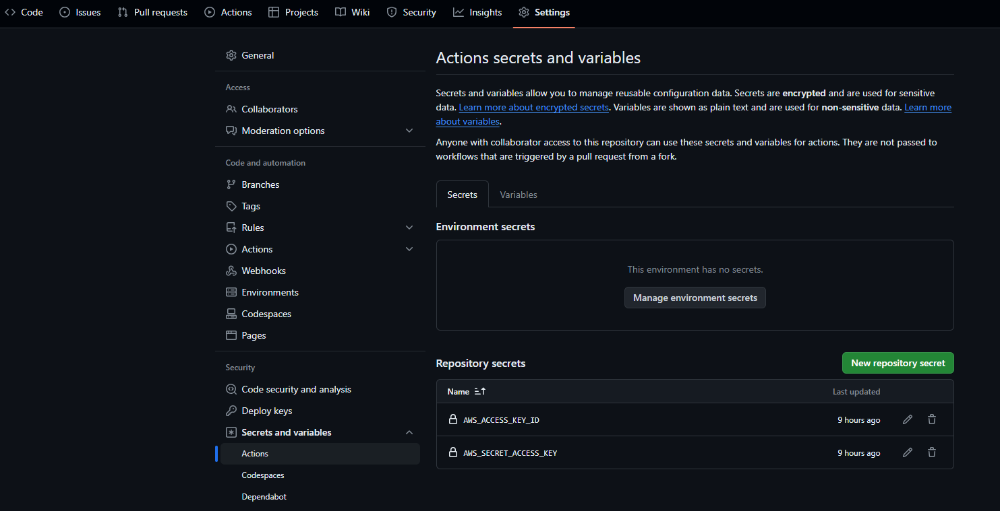
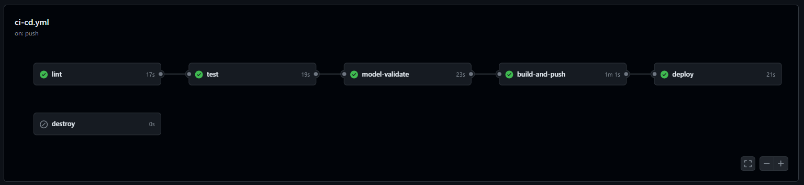
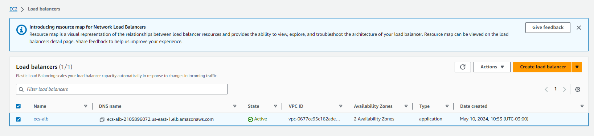
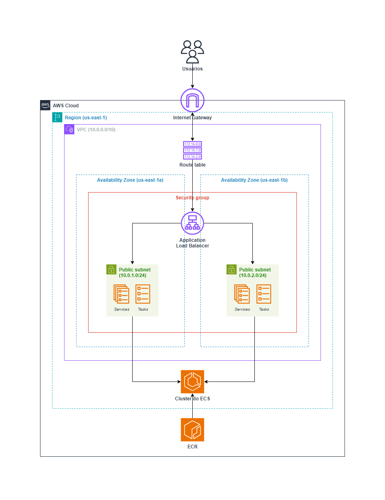

# UFSCar - ML in Production - Módulo Eng. de ML 2 - Atividade 2

## Projeto de classificação de Iris com esteira de CI/CD com Actions do GitHub

Este repositório contém o código e os artefatos para a atividade 2 do módulo 2 de Engenharia de Machine Learning, parte do curso de pós-graduação *ML in Production* da UFSCar. O projeto consiste em um modelo de Machine Learning para classificar flores Iris, uma API Flask para predição online, Docker para containerização da aplicação, Terraform para provisionamento de recursos na AWS, e esteira de CI/CD.

## Estrutura do repositório

```bash
/ufscar-mlp-eml2-ativ2
├── .github
│   └── workflows
│       ├── ci-cd.yml
│       └── terraform-backend.yml
├── Dockerfile
├── README.md
├── cicd_pipeline.png
├── infra
│   ├── ecr
│   ├── ecs
│   ├── terraform-backend-ecr
│   └── terraform-backend-ecs
├── iris_model.pkl
├── requirements.txt
└── src
    ├── __init__.py
    ├── app.py
    ├── model.py
    ├── validate.py
    └── tests
        ├── test_app.py
        ├── test_model.py
        └── test_validate.py
```

## Pré-requisitos

Antes de começar, você precisará ter o Docker instalado em sua máquina. Você pode instalar o Docker seguindo as instruções no [site oficial do Docker](https://www.docker.com/products/docker-desktop).

E é ncessário definir os *secrets* com as credenciais da AWS no GitHub.



## Como Rodar o Projeto

### Passo 1: Clonar o repositório

Clone o repositório para sua máquina local usando:

```bash
git clone https://github.com/plbalmeida/ufscar-mlp-eml2-ativ2.git
```

### Passo 2: Treinar o modelo de ML

Executar o seguinte comando:

```bash
python src/model.py
```

É esperado que o arquivo `iris_model.pkl` seja gerado na raíz do diretório do repositório.

### Passo 3: Execução da esteira de CI/CD

Primeiro, crie o backend do Terraform fazendo o merge para a branch `terraform-backend`.

Faça o push utilizando o seguinte comando para a branch `main` do repositório:

```bash
git push
```

É esperado que o pipeline de CI/CD no Actions do GitHub seja executado com sucesso.



O pipeline de CI/CD definido no GitHub Actions organiza o fluxo de trabalho em seis etapas principais: `lint`, `test`, `model-validate`, `build-and-push`, `deploy` e `destroy`. Aqui está um resumo de cada job e o que eles fazem:

#### `lint`
**Objetivo**: Validar o código-fonte usando ferramentas de linting.
- **Checkout code**: Esta etapa clona o código-fonte do repositório GitHub para o ambiente do runner do GitHub Actions.
- **Setup Python**: Configura a versão do Python para a execução no runner.
- **Install dependencies**: Instala todas as dependências necessárias definidas no `requirements.txt`.
- **Run Flake8**: Executa o linter `flake8` para verificar a conformidade do código com as diretrizes de estilo, ajudando a garantir que não contenham erros básicos de sintaxe ou estilo.

#### `test`
**Objetivo**: Executar testes automatizados para verificar a funcionalidade do código.
- **Dependências**: Este job depende do sucesso do job `lint`, garantindo que os testes só ocorram após a validação bem-sucedida do código.
- **Checkout code**: Clona novamente o código-fonte para garantir que os testes sejam executados na versão mais atual.
- **Setup Python**: Prepara o ambiente Python especificado.
- **Install dependencies**: Instala as dependências necessárias para os testes.
- **Run tests**: Executa os testes unitários configurados no diretório `tests` do projeto, garantindo que o código funcione conforme esperado.

#### `model-validate`
**Objetivo**: Validar a acurácia do modelo de machine learning.
- **Dependências**: Este job depende do sucesso do job `test`.
- **Checkout code**: Clona o código-fonte para o ambiente do runner.
- **Setup Python**: Configura a versão do Python especificada.
- **Install dependencies**: Instala as dependências necessárias para a validação do modelo.
- **Validate model accuracy**: Executa um script Python para avaliar a acurácia do modelo.

#### `build-and-push`
**Objetivo**: Construir e enviar imagens Docker para o Docker Hub e Amazon ECR.
- **Dependências**: Depende do sucesso do job `model-validate`, assegurando que as imagens Docker só sejam construídas e enviadas após a validação do modelo.
- **Checkout code**: Clona o código-fonte para o ambiente do runner.
- **Configure AWS credentials**: Configura as credenciais da AWS necessárias para interagir com os serviços AWS.
- **Setup Terraform e inicialização**: Configura o Terraform e inicializa os módulos necessários para gerenciar recursos da AWS.
- **Terraform Plan e Apply**: Executa o planejamento e aplicação do Terraform para provisionar recursos necessários no AWS ECR.
- **Log in to Docker Hub e Amazon ECR**: Autentica nos serviços Docker Hub e Amazon ECR para permitir o envio das imagens.
- **Build and push Docker image**: Constrói a imagem Docker baseada no `Dockerfile` e envia a imagem para os repositórios especificados.

#### `deploy`
**Objetivo**: Realizar o deploy da imagem Docker para a AWS ECS.
- **Dependências**: Este job depende do sucesso do job `build-and-push`, garantindo que o deploy só ocorra após a imagem Docker ser construída e enviada com sucesso.
- **Setup Terraform e inicialização**: Configura o Terraform e inicializa os módulos necessários para o deploy no AWS ECS.
- **Terraform Plan e Apply**: Planeja e aplica as configurações do Terraform para atualizar os serviços da AWS ECS com a nova imagem Docker.

#### `destroy`
**Objetivo**: Destruir os recursos provisionados no AWS ECS e ECR quando necessário.
- **Checkout code**: Clona o código-fonte para o ambiente do runner.
- **Setup Terraform e inicialização**: Configura o Terraform e inicializa os módulos para a destruição dos recursos.
- **Terraform Destroy**: Executa a destruição dos recursos no AWS ECS e ECR, removendo-os completamente.

Resumidamente:

- **`lint`**: foca na qualidade do código e conformidade com padrões de codificação.
- **`test`**: foca na corretude e funcionalidade do código através de testes automatizados.
- **`model-validate`**: foca na validação da acurácia do modelo.
- **`build-and-push`**: foca na preparação e disponibilização da imagem Docker.
- **`deploy`**: foca na implementação da aplicação em um ambiente de produção.

### Passo 4: Predições com o endpoint do modelo

Acessar o console da AWS *EC2 > Load balancers* e usar o endpoint do *DNS name* para as predições.



```bash
curl -X POST \
     http://ecs-alb-2105896072.us-east-1.elb.amazonaws.com:8080/predict \
     -H "Content-Type: application/json" \
     -d '{"features": [5.1, 3.5, 1.4, 0.2]}'
```

O retorno esperado é o seguinte:

```bash
{"prediction":0}
```

### Passo 5: Destruição dos recursos provisionados na AWS

Para destruir os recursos provisionados pelo pipeline de CI/CD na AWS faça o merge para a branch `infra-destroy`.

## Arquitetura da aplicação



A seguir é detalhada a arquitetura da splicação na AWS para suportar a aplicação Flask que serve um modelo de previsão usando o Amazon ECS:

1. **VPC e Subnets**:
   - A VPC `aws_vpc.main` com CIDR `10.0.0.0/16` define o espaço de rede isolado onde todos os recursos residem.
   - Dentro da VPC, existem duas subnets públicas, `aws_subnet.ecs_subnet1` (10.0.1.0/24) e `aws_subnet.ecs_subnet2` (10.0.2.0/24), localizadas em zonas de disponibilidade diferentes (us-east-1a e us-east-1b), aumentando a alta disponibilidade da aplicação.

2. **Internet Gateway e Route Table**:
   - Um Internet Gateway `aws_internet_gateway.igw` está associado à VPC, permitindo comunicação entre os recursos na VPC e a internet.
   - A Route Table `aws_route_table.rtb` tem uma rota que direciona todo o tráfego destinado a IPs externos para o Internet Gateway, e está associada a ambas as subnets.

3. **Security Group**:
   - O Security Group `aws_security_group.ecs_sg` define as regras de tráfego, permitindo tráfego de entrada na porta 8080 (onde a aplicação Flask escuta) e permitindo o tráfego de saída nas portas 443 e todas as outras, garantindo que a aplicação possa comunicar-se com a internet e outros serviços AWS de forma segura.

4. **ECS Components (Elastic Container Service)**:
   - **ECS Cluster**: O `aws_ecs_cluster.ecs_cluster` organiza os recursos do ECS, como serviços e tarefas.
   - **ECS Task Definition**: A definição de tarefa `aws_ecs_task_definition.ecs_task` especifica o contêiner a ser executado, incluindo a configuração de CPU, memória, e a imagem do contêiner (armazenada no ECR e especificada pela variável `var.docker_image`). O contêiner também mapeia a porta 8080 do contêiner para a mesma porta no host, facilitando o acesso ao serviço Flask.
   - **ECS Service**: O serviço `aws_ecs_service.ecs_service` mantém a aplicação Flask rodando continuamente, assegurando que o número desejado de instâncias da definição de tarefa esteja sempre executando. O serviço é configurado para utilizar o tipo de lançamento FARGATE, que simplifica a operação ao gerenciar a infraestrutura subjacente.

5. **Load Balancer**:
   - O Application Load Balancer `aws_lb.ecs_alb` distribui o tráfego de entrada entre as instâncias do contêiner rodando em subnets diferentes. Este ALB é associado ao mesmo Security Group e subnets que as tarefas do ECS.
   - Um Target Group `aws_lb_target_group.ecs_tg` está configurado para direcionar o tráfego na porta 8080 e realiza verificações de saúde no caminho `/health` para garantir que apenas instâncias saudáveis recebam tráfego.
   - Um Listener `aws_lb_listener.ecs_listener` no ALB escuta na porta 8080 e encaminha o tráfego para o Target Group, usando a ação "forward".

6. **Elastic Container Registry (ECR)**:
   - O repositório ECR `aws_ecr_repository.ufscar_mlp_eml2_ativ2` armazena as imagens Docker utilizadas pela tarefa do ECS. A configuração de escaneamento de imagem está ativada para garantir que as imagens sejam verificadas quanto a vulnerabilidades antes de serem implantadas.

Esta arquitetura garante que a aplicação Flask seja altamente disponível, segura e escalável, permitindo um gerenciamento eficiente dos recursos e tráfego. A aplicação serve o modelo que pode ser acessado através de uma API HTTP, processando solicitações de previsão com base em características de entrada fornecidas pelos usuários.

# Contribuições

Contribuições são bem-vindas. Para contribuir, por favor, crie um pull request para revisão.